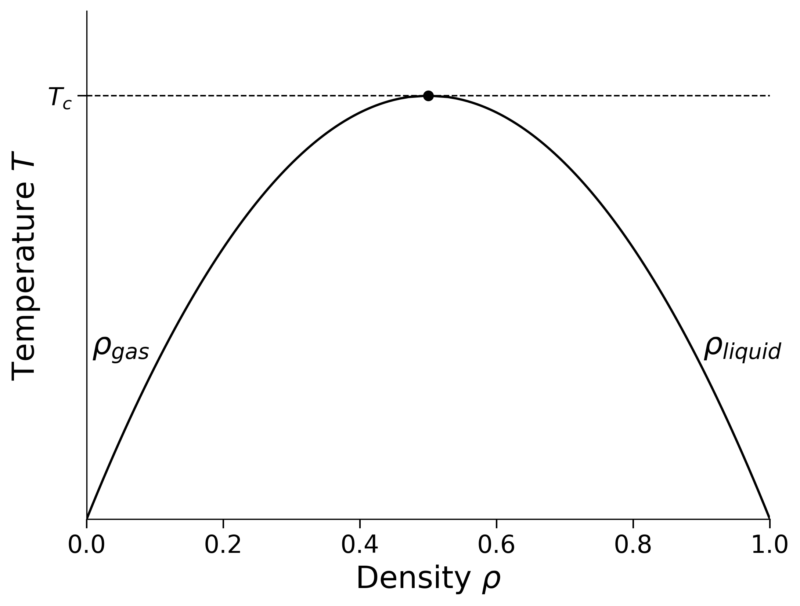

<h1 style="font-size: 2em; line-height: 1.15; margin-bottom: 0.25em;">PHYSM0071: Coursework 1</h1>

*Correlations and fluctuations in a two-dimensional lattice gas*

## 1. Aim

Use grand-canonical Monte Carlo simulation to investigate the two-dimensional square-lattice gas. Its mapping to the Ising model predicts the phase behaviour; the simulations then probe the equation of state, density response, spatial correlations and density distribution.

The Monte Carlo algorithm is supplied. You must write short Python programs to run the required state points, analyse the measurements and produce the figures, but the assessment focuses on the physical analysis and interpretation rather than programming technique.

## 2. Physical background

### 2.1 The lattice gas

Each site of an $L\times L$ square lattice is occupied $(c_i=1)$ or vacant $(c_i=0)$, with periodic boundaries. The number of lattice sites is $V=L^2$. Define

$$
N=\sum_i c_i,\qquad \rho=\frac{N}{V},
$$

and

$$
E=-\epsilon\sum_{\langle i,j\rangle}c_i c_j .
$$

Here $\epsilon>0$ is the nearest-neighbour attraction and $\langle i,j\rangle$ denotes each distinct nearest-neighbour pair once. The grand-canonical probability of a configuration is

$$
P(\{c_i\})\propto
\exp[-\beta(E-\mu N)],
\qquad
\beta=(k_{\rm B}T)^{-1}.
$$

Here $\mu$ is the chemical potential, $T$ is the temperature and $k_{\rm B}$ is Boltzmann's constant. All simulations use $\epsilon=k_{\rm B}=1$ unless stated otherwise.

### 2.2 Phase behaviour

The phase diagram is shown below in the temperature--density plane. Below the critical temperature, the two branches of the curve give the coexisting low- and high-density phases. Mean densities between these branches lie in the two-phase region. The branches meet at $\rho_c=1/2$ and $T=T_c$.

{width=45% fig-align="center" #fig-lattgas}

In the thermodynamic limit, coexistence is a line in the chemical-potential--temperature plane. At fixed $T<T_c$, the equilibrium density changes discontinuously as this line is crossed; above $T_c$, it changes continuously. Particle--hole symmetry makes the two coexistence densities symmetric about $\rho=1/2$. You will derive the coexistence chemical potential and the value of $T_c$ in the mapping exercise.

### 2.3 Grand-canonical Monte Carlo

The simulation samples configurations with probability

$$
P(\{c_i\})\propto\exp[-\beta(E-\mu N)].
$$

One grand-canonical Metropolis trial consists of:

1. choosing a lattice site uniformly at random;
2. proposing to insert a particle if it is vacant, or remove it if it is occupied;
3. calculating $\Delta E$, $\Delta N$, and hence $\Delta(E-\mu N)=\Delta E-\mu\Delta N$;
4. accepting the move with probability
   $$
   p_{\rm acc}=\min\{1,\exp[-\beta\Delta(E-\mu N)]\}.
   $$

One Monte Carlo sweep is $L^2$ such trials. In a simulation, an initial equilibration period is discarded before measurements are taken. Successive measurements are generally correlated, and this must be allowed for when estimating uncertainties.

## 3. Carrying out the computational work

### 3.1 Preparatory work in Noteable

Complete this setup during the week before the exercises in Section 4 are released. It is not assessed; its purpose is to identify any access or software problems before you begin the coursework.

1. On the PHYSM0071 Blackboard page, open **Resources and tools**, scroll to **Noteable**, and launch it. If you are working off campus, connect to the University VPN first.
2. Select the **Jupyter Notebook (Legacy)** server option.
3. When Noteable opens, click **+GitRepo**, enter

   ```text
   https://github.com/nbwilding/Lattice-gas-coursework
   ```

   and press **Clone** (no username or password is required). This creates a folder called `Lattice-gas-coursework` containing `Full_lattice_gas_GCE.py`.
4. Open a terminal in Noteable, change into the downloaded folder,

   ```bash
   cd Lattice-gas-coursework
   ```

   and run the following short test, replacing `1234567` with your own seven-digit student number:

   ```bash
   python Full_lattice_gas_GCE.py \
     --L 12 \
     --temperatures 1.0 \
     --chemical-potentials -2.0 \
     --equilibration-sweeps 100 \
     --sweeps-per-measurement 2 \
     --measurements 100 \
     --seed 1234567 \
     --output test_output
   ```

5. Check that the command finishes without an error and creates the `test_output` folder. The first run may pause briefly while Numba compiles the simulation functions.

This is only a setup check; its results are not used in the report. Do not modify `Full_lattice_gas_GCE.py`. Once Section 4 is released, put your own simulation driver and analysis code in separate files. Report any problem with cloning or running the program before the exercises are released, including the full error message.

