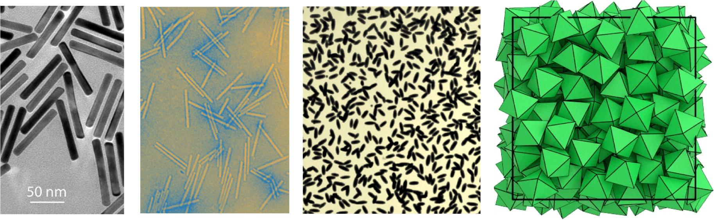

## What are Liquid Crystals?

::: {.incremental}
- Intermediate phases between **liquids** and **crystals**
- Exhibit **orientational order** without full positional order
- Formed by **anisotropic particles** (rods, ellipsoids, plates)
- Key property: **decoupling** of orientational and translational degrees of freedom
:::

## Types of Order

**Positional order**: Regular arrangement of particle positions (lattice)

**Orientational order**: Angular alignment of particles

| Phase | Positional | Orientational |
|-------|-----------|---------------|
| Crystal | Yes (3D) | Yes |
| Liquid | No | No |
| **Liquid Crystal** | **Partial/No** | **Yes** |

## Anisotropic Particles

Various shapes: rods, ellipsoids, plates, polyhedra

## Liquid Crystal Phases (1)

::: {.incremental}
- **Isotropic fluid**: No long-range order (like normal liquids)
- **Nematic phase**: Orientational order, no positional order
  - Particles align along a common direction: the **director** $\mathbf{n}$
- **Chiral nematic (Cholesteric)**: Director forms a helix
:::

---

## Liquid Crystal Phases (2)

::: {.incremental}
- **Smectic phase**: Layered structure with orientational order
  - Positional order in 1D (layers)
  - Liquid-like within layers
- **Columnar phase**: Particles stack into columns
  - 2D positional order
- **Crystal**: Full 3D positional + orientational order
:::

---

## Phase Comparison

| Phase | Positional Order | Orientational Order |
|-------|-----------------|---------------------|
| Isotropic | No | No |
| Nematic | No | Yes (long-range) |
| Smectic | Yes (1D: layered) | Yes |
| Columnar | Yes (2D: columns) | Yes |
| Crystal | Yes (3D: lattice) | Yes |

---

## The Nematic Order Parameter

For **head-tail symmetric** rods, we cannot simply average orientations.

Instead, construct the **alignment tensor** (traceless, second moment):

$$
\mathbf{Q}=\dfrac{d}{2}\left\langle\mathbf{u}_i \otimes \mathbf{u}_i-\dfrac{1}{d}\mathbf{I}\right\rangle
$$

where $d$ is dimensionality, $\mathbf{u}_i$ is the unit orientation vector.

---

## Extracting Order

Diagonalize $\mathbf{Q}$:

- **Largest eigenvalue** $\rightarrow$ scalar order parameter $\mathcal{S}$
- **Corresponding eigenvector** $\rightarrow$ director $\mathbf{n}$

$$
\mathcal{S} \in [0, 1]
$$

- $\mathcal{S} = 0$: isotropic (random orientations)
- $\mathcal{S} = 1$: perfect nematic order (all aligned)

---

## 3D Nematic Order Parameter

In 3D, choosing coordinates along director $\mathbf{n}$:

$$
\mathcal{S}=\dfrac{1}{2} \left\langle 3\cos ^2 \theta_i-1\right\rangle
$$

where $\theta_i$ is angle between particle $i$ and director.

This uses the **Legendre polynomial** $P_2(\cos\theta)$ to enforce head-tail symmetry.

---

## Probability Distribution

For a system with cylindrical symmetry around $\mathbf{n}$:

$$
p(\theta) = \text{probability density of finding rod at angle } \theta
$$

Then:

$$
\mathcal{S}=2\pi \int_0^{\pi}P_2(\cos\theta)p(\theta)\sin\theta d\theta
$$

---

## Landau-de Gennes Theory (1)

Construct free energy density using tensor invariants:

$$
f=f_0+\frac{A}{2} \operatorname{tr} \mathbf{Q}^2-\frac{B}{3} \operatorname{tr} \mathbf{Q}^3+\frac{C}{4}\left(\operatorname{tr} \mathbf{Q}^2\right)^2
$$

For uniaxial nematic:

$$
\operatorname{Tr}\left(\mathbf{Q}^2\right)=\frac{2}{3} \mathcal{S}^2 \quad,\quad
\operatorname{Tr}\left(\mathbf{Q}^3\right)=\frac{2}{9} \mathcal{S}^3
$$

---

## Landau-de Gennes Theory (2)

Substitute to get:

$$
f=f_0+\frac{A}{3}\mathcal{S}^2-\frac{2B}{27}\mathcal{S}^3+\frac{C}{9}\mathcal{S}^4
$$

Expand coefficients around reference temperature $T^*$:

$$
A(T)=a\left(T-T^*\right), \quad B(T)= b, \quad C(T)=c
$$

with $a,b,c>0$.

---

## Landau-de Gennes Theory (3)

Final form:

$$
f-f_0=\frac{a}{3}\left(T-T^{\ast}\right) \mathcal{S}^2-\frac{2 b}{27} \mathcal{S}^3+\frac{c}{9} \mathcal{S}^4
$$

Predicts **first-order** isotropic-nematic transition at:

$$
T_{NI}=T^{\ast}+\frac{b^2}{27 a c}
$$

No critical point (different symmetries).

---

## Maier-Saupe Theory (1)

Minimal ingredients for nematic transition:

1. **Attractive interactions** favoring alignment
2. **Entropy** from orientational distribution

Free energy:

$$
f = f_0 - u\dfrac{\mathcal{S}^2}{2}+k_BT \int_0^\pi p(\theta) \ln (4\pi p(\theta)) \sin\theta d\theta
$$

---

## Maier-Saupe Theory (2)

Minimize with respect to $p(\theta)$ using Lagrange multiplier:

$$
p(\theta) = \frac{1}{Z} \exp\left( \frac{u \mathcal{S}}{k_B T} P_2(\cos\theta) \right)
$$

where $Z$ is the partition function:

$$
Z = \int_0^\pi \exp\left( \frac{u \mathcal{S}}{k_B T} P_2(\cos\theta) \right) \sin\theta d\theta
$$

---

## Maier-Saupe Theory (3)

Self-consistency: $\mathcal{S}$ must satisfy:

$$
\mathcal{S}=2\pi \int_0^{\pi}P_2(\cos\theta)p(\theta)\sin\theta d\theta
$$

Yields **weakly first-order** transition with two stability basins.

---

## Lebwohl-Lasher Lattice Model

Discrete lattice version of Maier-Saupe:

$$
H = -\epsilon \sum_{\langle i, j \rangle} \left[ \frac{3}{2} (\mathbf{n}_i \cdot \mathbf{n}_j)^2 - \frac{1}{2} \right]
$$

- Each site has unit director $\mathbf{n}_i$
- Favors alignment between neighbors
- Captures isotropic-nematic transition

---

## 2D Lebwohl-Lasher Model

In 2D with angle $\theta_i$:

$$
H = -\epsilon \sum_{\langle i, j \rangle} \left[ \frac{3}{2} \cos^2(\theta_i - \theta_j) - \frac{1}{2} \right]
$$

Monte Carlo simulation shows:

- High $T$: isotropic (random)
- Low $T$: ordered patches (nematic)

---

## Frank Elastic Theory

In continuum limit, director field $\mathbf{n}(\mathbf{r})$ can deform.

**Frank free energy density**:

$$
f = \frac{1}{2} K_1 (\nabla \cdot \mathbf{n})^2
    + \frac{1}{2} K_2 [\mathbf{n} \cdot (\nabla \times \mathbf{n})]^2
    + \frac{1}{2} K_3 [\mathbf{n} \times (\nabla \times \mathbf{n})]^2
$$

---

## Frank Elastic Constants

Three deformation modes:

- $K_1$: **Splay** elastic constant
- $K_2$: **Twist** elastic constant  
- $K_3$: **Bend** elastic constant

Each penalizes a specific type of director distortion.

---

## Topological Defects (1)

**Disclinations**: Singularities in director field that cannot be removed by continuous deformation.

**Topologically protected**: Cannot smoothly transform to uniform state.

In 2D, characterized by **topological charge** $s$:

$$
\Delta \theta = 2\pi s
$$

(rotation of director around closed loop)

---

## Topological Defects (2)

Common charges:

- $s = +1/2$: director rotates by $+\pi$
- $s = -1/2$: director rotates by $-\pi$
- $s = +1$: director rotates by $+2\pi$
- $s = -1$: director rotates by $-2\pi$

---

## Defect Annihilation

When defects of **opposite charges** meet:

$$
s = +1/2 \quad + \quad s = -1/2 \quad \rightarrow \quad \text{annihilation}
$$

Restores uniform order. Key relaxation mechanism in liquid crystals.

---

## 3D Topological Defects

In 3D:

- **Line defects** (not just points)
- Complex topology: loops, entanglements, reconnections
- **Hedgehogs**, **monopoles**, complex textures
- Classified using rotation group SO(3)

More complex than 2D case.

---

## Summary

::: {.incremental}
- Liquid crystals: intermediate phases with orientational order
- Order parameter $\mathcal{S}$ and director $\mathbf{n}$
- Landau-de Gennes & Maier-Saupe theories predict first-order transitions
- Lattice models (Lebwohl-Lasher) capture essential physics
- Continuum: Frank elastic theory for deformations
- Topological defects: protected singularities with charge conservation
:::

---

## References {.unnumbered}
