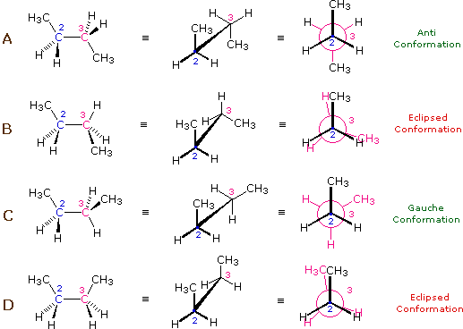
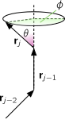

## What are Polymers? {.smaller}

:::: {.columns}

::: {.column width="60%"}
- **Large molecules** made of many **monomers**
- Degree of polymerization: $N > 10^5$ units possible
- **Macroscopic behavior** dominated by large-scale properties
- **Statistical mechanics** needed even for single chains

**Key insight**: Fine structure details → Coarse-grained models
:::

::: {.column width="40%"}
{width="300px"}

*Conformers of butane*
:::

::::

---

## Polymer Architectures {.smaller}

- **Linear**: Straight chains (e.g., polyethylene)
- **Branched**: Main chain + side branches  
- **Star**: Multiple arms from central core
- **Cross-linked**: Network structures (rubbers, thermosets)

**Focus**: Linear homopolymers for theoretical simplicity

---

## Statistical Nature of Polymer Conformations {.smaller}

:::: {.columns}

::: {.column width="50%"}
**Why statistical?**
- Enormous number of configurations
- Thermal fluctuations drive conformational changes
- Only **average properties** are measurable

**Key quantities:**
- End-to-end vector $\mathbf{R}$
- Radius of gyration $R_g$
:::

::: {.column width="50%"}
**Dilute solutions**: Polymer-solvent interactions dominate

**Concentrated**: Polymer-polymer entanglements
:::

::::

---

## Freely-Jointed Chain Model {.smaller}

:::: {.columns}

::: {.column width="60%"}
**Assumptions:**
- $N$ segments of fixed length $b_0$
- All bond angles equally likely
- **Random walk** in 3D

**End-to-end vector:**
$$\mathbf{R} = \sum_{j=1}^N \mathbf{r}_j$$
:::

::: {.column width="40%"}
**Key result:**
$$\langle R^2 \rangle = N b_0^2$$

**Scaling:** $R \propto N^{1/2}$
:::

::::

---

## Random Walk Statistics {.smaller}

For large $N$, the end-to-end distance follows a **Gaussian distribution**:

$$P(\mathbf{R}) = \left(\frac{3}{2\pi N b_0^2}\right)^{3/2} \exp\left(-\frac{3 R^2}{2 N b_0^2}\right)$$

**Radius of gyration:**
$$\langle R_g^2 \rangle = \frac{1}{6} \langle R^2 \rangle$$

---

## Freely-Rotating Chain {.smaller}

:::: {.columns}

::: {.column width="60%"}
**More realistic model:**
- Fixed **valence angles** θ
- Free rotation about bonds
- Introduces **persistence**

{width="250px"}
:::

::: {.column width="40%"}
**Result:**
$$\langle R^2 \rangle = C N b_0^2$$

where $C = \frac{1 + \cos\theta}{1 - \cos\theta}$
:::

::::

---

## Effect of Bond Angle {.smaller}

**Three regimes:**

1. **$\theta \to 0$**: $C \gg 1$ → **Rigid rod**
   $$\langle R^2 \rangle \gg N b_0^2$$

2. **$\theta \to \pi$**: $C \ll 1$ → **Collapsed globule**  
   $$\langle R^2 \rangle \ll N b_0^2$$

3. **$\theta = 90°$**: $C = 1$ → **Ideal random walk**
   $$\langle R^2 \rangle = N b_0^2$$

---

## Persistence and Kuhn Length {.smaller}

**Coarse-graining approach:**
- Replace real chain with equivalent **freely-jointed** chain
- Same contour length: $N b_0 = N' b$
- Same end-to-end distance: $C N b_0^2 = N' b^2$

**Results:**
- **Kuhn length**: $b = C b_0$  
- **Persistence length**: $\ell_p = b/2$
- **Kuhn segments**: $N' = N/C$

---

## Excluded Volume Effects {.smaller}

**Problem**: Monomers cannot occupy same space

**Volume fraction analysis:**
$$\frac{V_{\text{monomers}}}{V_{\text{coil}}} = \frac{N b^3}{N^{3/2} b^3} \sim N^{-1/2}$$

For $N = 10^4$: only ~1% of coil volume occupied!

---

## Self-Avoiding Walk {.smaller}

**Balance of competing effects:**

1. **Entropy**: Favors compact configurations
2. **Excluded volume**: Favors chain expansion

**Free energy minimization:**
$$F = \frac{\varepsilon N^2 V_1}{R^3} + \frac{3 k_B T R^2}{2 N b^2}$$

**Result:** $R \sim N^{3/5} b$ (vs. $N^{1/2}$ for ideal chain)

---

## Good vs. Poor Solvents {.smaller}

**Interaction energies**: $\varepsilon_{sp}$, $\varepsilon_{ss}$, $\varepsilon_{pp}$

**Good solvent**: $\varepsilon_{sp} < \frac{1}{2}(\varepsilon_{ss} + \varepsilon_{pp})$
- Monomers prefer solvent contact
- Chain **swells**: $\nu = 3/5$

**Poor solvent**: $\varepsilon_{sp} > \frac{1}{2}(\varepsilon_{ss} + \varepsilon_{pp})$  
- Monomers prefer each other
- Chain **collapses**

---

## Theta Conditions {.smaller}

**Theta temperature** $T = \theta$:
- Excluded volume and attraction **cancel**
- Chain has **ideal dimensions**: $R \sim N^{1/2}$
- **Theta solvent** at this temperature

**Temperature effects:**
- High $T$: Good solvent behavior
- Low $T$: Poor solvent, phase separation
- $T = \theta$: Ideal chain behavior

---

## Scaling Exponents Summary {.smaller}

| **Chain type** | **Exponent $\nu$** | **Physics** |
|---|---|---|
| Freely-jointed | 1/2 | Random walk |
| Freely-rotating | 1/2 | Persistent random walk |
| Self-avoiding | 3/5 ≈ 0.6 | Excluded volume |
| Theta conditions | 1/2 | Balanced interactions |
| Poor solvent | < 1/2 | Collapsed |

**Universal behavior**: $R \sim N^\nu$

---

## Concentration Regimes {.smaller}

**Dilute regime**: $c \ll c^*$
- Isolated coils, no overlap

**Overlap concentration**:
$$c^* = \frac{3M}{4\pi N_A R_g^3} \propto M^{1-3\nu}$$

**Semi-dilute**: $c > c^*$  
- Interpenetrating coils, entanglements

**Concentrated/Bulk**: $c \approx \rho_{\text{bulk}}$
- Polymer-dominated properties

---

## Overlap Concentration Example {.smaller}

**Polystyrene**: $M = 10^6$ g/mol, good solvent ($\nu = 0.6$)

$$c^* = 0.29 \text{ mg/ml}$$

**Volume fraction**: $c^*/\rho = 0.28 \times 10^{-3}$

**Key insight**: $c^*$ very small for large polymers!

---

## Bulk Polymer Classes {.smaller}

**Cross-linked polymers:**
- **Elastomers**: Low cross-linking → flexible, elastic
- **Thermosets**: High cross-linking → rigid, brittle

**Thermoplastics**: No cross-linking
- **Melt**: High $T$, random coils
- **Crystal**: $T < T_m$, ordered structure  
- **Glass**: Rapid cooling below $T_g$, amorphous

---

## Chain Flexibility and Persistence {.smaller}

**Correlation along chain:**
$$\langle \mathbf{r}_i \cdot \mathbf{r}_{i+n} \rangle = b_0^2 e^{-n b_0/\ell_p}$$

**Length scales:**
- **Monomer scale**: Chemical structure
- **Persistence scale**: $\ell_p$ (stiffness)
- **Global scale**: $R_g$ (overall size)

**Universal behavior** emerges at large scales!

---

## Gyration Tensor {.smaller}

**Shape characterization:**
$$\mathbf{S} = \frac{1}{N} \sum_{j=1}^N (\mathbf{R}_j - \mathbf{R}_{\text{CM}}) \otimes (\mathbf{R}_j - \mathbf{R}_{\text{CM}})$$

- **Eigenvalues**: Principal dimensions
- **Eigenvectors**: Principal axes
- **Trace**: $R_g^2 = \text{Tr}(\mathbf{S})$

**Versatile**: Works for any architecture!

---

## Temperature Effects in Solutions {.smaller}

**High temperature**: 
- Excluded volume dominates
- Good solvent conditions
- Extended conformations

**Low temperature**:
- Attractive interactions dominate  
- Poor solvent conditions
- Collapsed conformations

**Crossover** at theta temperature

---

## Experimental Observables {.smaller}

**Light scattering**: Measures $R_g$
**Viscosity**: Sensitive to chain extension
**Osmotic pressure**: Concentration effects
**Neutron scattering**: Internal structure

**Scaling relations**:
- $R_g \sim N^\nu$
- $[\eta] \sim M^\alpha$ (intrinsic viscosity)
- $\Pi \sim c^{9/4}$ (semi-dilute osmotic pressure)

---

## Biological Relevance {.smaller}

**DNA**: Persistence length ~50 nm
- Semiflexible polymer
- Supercoiling, packaging

**Proteins**: Folded vs. unfolded states
- Good/poor solvent analogy
- Collapse transitions

**Chromatin**: Hierarchical organization
- Multiple length scales
- Fractal-like structures

---

## Simulation Approaches {.smaller}

**Molecular dynamics**: Atomistic detail
**Monte Carlo**: Statistical sampling
**Coarse-grained models**: 
- Bead-spring chains
- Worm-like chains
- Lattice models

**Key**: Match experimental scaling laws

---

## Theoretical Framework {.smaller}

**Statistical mechanics** of **single chains**:
1. **Microscopic model** (chemical structure)
2. **Coarse-graining** (effective parameters)  
3. **Universal behavior** (scaling exponents)
4. **Environmental effects** (solvent quality)

**Success**: Simple theories capture complex behavior!

---

## Applications and Examples {.smaller}

**Synthetic polymers**:
- Polystyrene, PMMA, natural rubber
- Industrial applications

**Biological polymers**:
- DNA, proteins, polysaccharides
- Cellular functions

**Modern materials**:
- Smart polymers, hydrogels
- Responsive systems

---

## Key Takeaways {.smaller}

1. **Large scale dominates**: Chemical details → Universal scaling
2. **Entropy vs. energy**: Competition determines conformation
3. **Solvent quality**: Critical for polymer behavior  
4. **Concentration effects**: Dilute → semi-dilute → bulk transitions
5. **Multiple length scales**: From monomers to global dimensions

**Central concept**: **Coarse-graining** reveals universal physics
<!-- 
---

## Open Questions & Research {.smaller}

- **Non-equilibrium dynamics**: Active polymers
- **Confined geometries**: Polymers in channels, pores
- **Polyelectrolytes**: Charged polymers
- **Entanglement dynamics**: Reptation theory
- **Machine learning**: Predicting polymer properties

**Future**: Connecting molecular design to macroscopic function

---

## Summary {.smaller}

**Polymers as statistical objects**:
- Random walk → Self-avoiding walk
- Universal scaling exponents
- Solvent quality effects
- Concentration regimes

**Theoretical success**: Simple models capture complex behavior through **coarse-graining** and **universality**

**Impact**: Foundation for understanding both synthetic and biological macromolecules -->